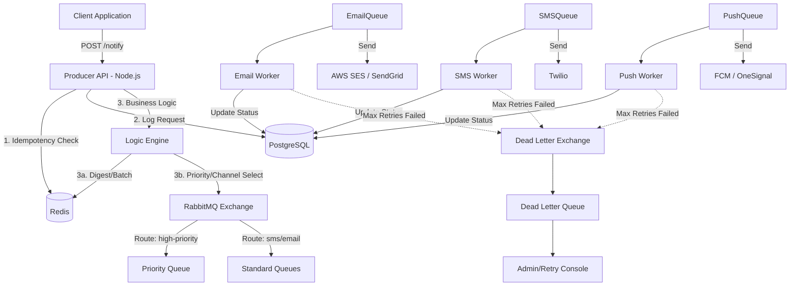

# NotifyFlow: HLD and Implementation Plan

NotifyFlow is a reliable, fault-tolerant notification microservice designed to handle 10,000+ concurrent requests. It bridges **Sophisticated Business Logic** (Digests, Priority, Throttling) with **Industrial-Grade Reliability** (Idempotency, DLQ, Fallbacks).

## Business vs. Technical Synergy

| Feature | Your Business Goal | My Technical Implementation |
| :--- | :--- | :--- |
| **Idempotency** | Prevent duplicate "Likes" | Postgres `idempotency_keys` + Redis Cache |
| **Throughput** | 10,000+ concurrent reqs | RabbitMQ Async Workers + Node.js Producer |
| **Safety** | Don't flood user (Digest) | Redis Aggregator Service |
| **Reliability** | 99.9% success rate | DLQ + Retries + Manual Inspection Console |
| **Throttling** | WhatsApp 8 msg/sec limit | Redis-backed Leaky Bucket / Token Bucket |
| **Priority** | OTP > Likes | RabbitMQ Priority Queues (x-max-priority) |

## The 99.9% Reliability Framework

To achieve a **99.9% reliability rate**, we implement a multi-layered safety net:

### 1. Guaranteed Delivery (The "At-Least-Once" Guarantee)
- **Producer Acknowledgments**: The API won't return `202 Accepted` until RabbitMQ confirms the message is persisted to disk.
- **Consumer Acknowledgments**: Workers only `ACK` a message after the provider (Twilio/SES) confirms receipt.

### 2. Intelligent Retry Strategy
- **Exponential Backoff**: If a provider is busy, we retry at 1m, 5m, 15m, and 1h intervals.
- **Dead Letter Isolation**: After 5 failed attempts, messages move to the **DLQ** for manual inspection/intervention.

### 3. Fault Tolerance & High Availability
- **Circuit Breakers**: Automatically stop sending to a failing provider to prevent "cascading failures".
- **Dynamic Fallbacks**: If Push (FCM) is down, the system automatically redirects critical OTPs to SMS.

### 4. Reconciliation Engine (The "Safety Valve")
- **Database Sweep**: A background job that runs every 30 mins to find any notification stuck in `SENDING` or `PENDING` state for too long and re-queues them.
- **Idempotency Guard**: The reconciliation engine uses the same `idempotency_key` to ensure we never send the same notification twice during a sweep.

### 5. Proactive Observability
- **Real-time Alerting**: Alerts trigger if DLQ size > 100 or if provider success rate drops below 95%.

### Architecture Diagram

### Data Flow
1. **Ingress**: API receives a request with an `idempotency_key`.
2. **Idempotency**: API verifies the key in Redis (cache) and Postgres (persistence). If the key was already processed successfully, it returns a cached response immediately.
3. **Queueing**: API pushes the message to a specific RabbitMQ exchange. RabbitMQ ensures the message is persisted to disk if necessary.
4. **Processing**: Specialized workers consume messages. For example, the `Email Worker` is optimized for SMTP/API latency of email providers.
5. **Reliability**:
   - **Retries**: RabbitMQ is configured with a retry policy (using TTL and dead-lettering back to the original queue or a dedicated retry queue).
   - **DLQ**: Messages that exceed retry limits are moved to a `Dead Letter Queue` for manual inspection.
6. **Persistence**: Every state change (PENDING -> QUEUED -> SENDING -> DELIVERED/FAILED) is logged in PostgreSQL.

## Proposed Changes

### 1. Infrastructure Setup
- [NEW] `docker-compose.yml`: Define services for RabbitMQ (with management plugin), PostgreSQL, and Redis.
- [NEW] `schema.sql`: Define `notifications` and `idempotency` tables.

### 2. Core Service (Producer API)
- [NEW] `src/api/index.ts`: Express/Fastify server.
- [NEW] `src/middleware/idempotency.ts`: Middleware to handle key checks.
- [NEW] `src/services/logic.engine.ts`: Classification (Transactional vs Promotional) and Channel Selection.
- [NEW] `src/services/digest.service.ts`: Redis-backed aggregator to prevent notification flooding.
- [NEW] `src/queue/producer.ts`: RabbitMQ connection with support for Priority Queues.

### 4. Workers & Throttling
- [NEW] `src/workers/base.worker.ts`: Abstract worker with built-in Rate Limiting (Throttling) logic.
- [NEW] `src/workers/email.worker.ts`: Consumer for email.
- [NEW] `src/workers/sms.worker.ts`: Consumer for SMS.
- [NEW] `src/workers/push.worker.ts`: Consumer for Push.
- [NEW] `src/queue/dlq.handler.ts`: Logic to handle and log DLQ messages.

### 5. Missing Pieces for 99.9% Reliability
- [NEW] **Observability**: Prometheus metrics for queue depth and Grafana dashboards.
- [NEW] **Fallback Strategy**: If Push fails, fallback to SMS for critical transactional alerts.
- [NEW] **Circuit Breaker**: Prevent wasting resources on a down provider (e.g., if Twilio is down).

## Verification Plan

### Automated Tests
- **Idempotency Test**: Script to send 100 identical requests concurrently and verify only 1 makes it to the queue.
- **Failover/DLQ Test**: Mock a provider failure, verify message retries 3 times, then moves to DLQ.
- **Load Test**: Use `k6` or `autocannon` to simulate 10,000 concurrent requests to the API.

### Manual Verification
- Access RabbitMQ Management UI at `localhost:15672` to inspect queue health.
- Query Postgres `notifications` table to check status lifecycle.
- Inspect Redis `GET idempotency:<key>` for key expiration.

## Educational Resources

To build a deep understanding of the messaging systems and patterns used in NotifyFlow, I recommend the following resources:

### 1. RabbitMQ Core Concepts
- [Official RabbitMQ Tutorials](https://www.rabbitmq.com/getstarted.html): Start with "Hello World" and "Work Queues" (Tutorial 1 & 2).
- [CloudAMQP RabbitMQ For Beginners](https://www.cloudamqp.com/blog/part1-rabbitmq-for-beginners-what-is-rabbitmq.html): A multi-part series that is very easy to digest.
- [RabbitMQ in 100 Seconds (Video)](https://www.youtube.com/watch?v=7rkeORD4jSw): A quick high-level overview.

### 2. Failure Handling & Dead Letter Queues (DLQ)
- [Official Guide: Dead Letter Exchanges](https://www.rabbitmq.com/dlx.html): Technical documentation on how DLX works.
- [Reliable Messaging with DLQs](https://www.cloudamqp.com/blog/when-and-how-to-use-the-rabbitmq-dead-letter-exchange.html): Best practices for isolating failed messages.

### 3. Idempotency & Reliability Patterns
- [The Idempotent Consumer Pattern](https://microservices.io/patterns/communication-style/idempotent-consumer.html): Essential for "at-least-once" delivery systems.
- [Handling Duplicates in RabbitMQ](https://www.cloudamqp.com/blog/how-to-handle-message-duplicates-in-rabbitmq.html): Practical strategies for deduplication.

### 4. Advanced Architecture
- [RabbitMQ Best Practices](https://www.cloudamqp.com/blog/rabbitmq-best-practice.html): A "cheat sheet" for performance and stability.
- [Enterprise Integration Patterns (EIP)](https://www.enterpriseintegrationpatterns.com/): The industry-standard catalog for messaging patterns.
